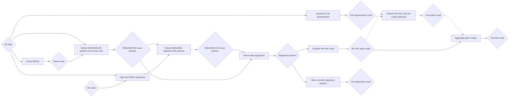

# Tissue masking process

## Mask extraction

```mermaid
graph LR
   A{HE slide} --> B[Tissue filtering]
   B --> C{Tissue mask}
   A --> D[HoverFast Cell Segmentation]
   E{IHC slide} --> F[High level affine registration]
   A --> F
   C --> G[Extract 5000x5000 HE patches from tissue zone]
   A --> G
   G --> H{5000x5000 HE tissue patches}
   F --> I[Extract 5000x5000 registered IHC patches]
   H --> I
   I --> J{5000x5000 IHC tissue patches}
   H --> K[Deformable registration]
   J --> K
   K --> L{Registered patches}
   L --> M[Compute HE+IHC mask]
   M --> N{HE+IHC patch mask}
   D --> O{Cell segmentation mask}
   O -.-> P["Intersect HE+IHC and cell masks (optional)"]
   N -.-> P
   P -.-> Q{Final patch mask}
   N --> R[Aggregate patch masks]
   Q -.-> R
   R --> S{Full slide mask}
   L --> T[Store correctly registered patches]
   T --> U{Full registration mask}
```