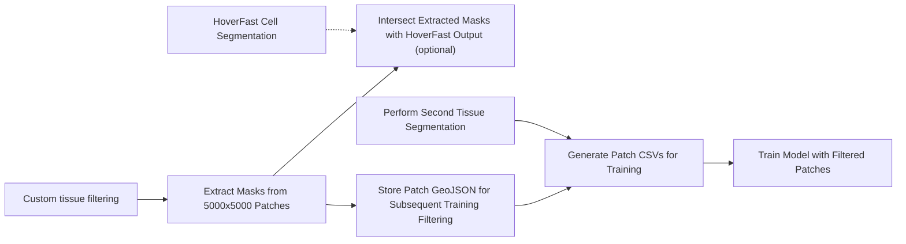

# Tissue masking process

```mermaid
graph LR
   C[HoverFast Cell Segmentation] -.-> E["Intersect Extracted Masks with HoverFast Output (optional)"]
   B[Custom tissue filtering] --> D[Extract Masks from 5000x5000 Patches]
   D --> E
   D --> F[Store Patch GeoJSON for Subsequent Training Filtering]
   G[Perform Second Tissue Segmentation] --> H
   F --> H[Generate Patch CSVs for Training]
   H --> I[Train Model with Filtered Patches]
```